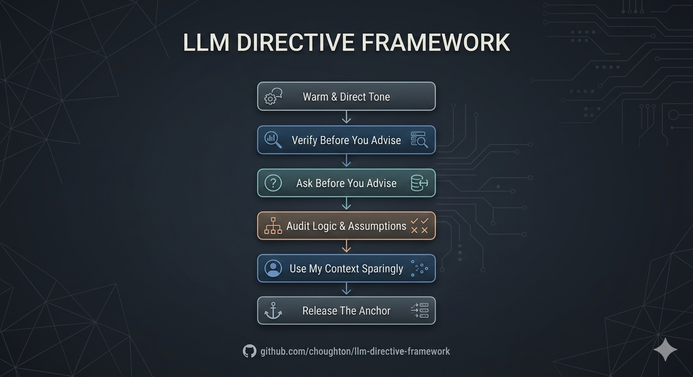

# llm-directive-framework

**Six directives that fix the five worst AI assistant behaviors -- works across Claude, Gemini, and ChatGPT.**



---

Five things every AI assistant does that waste your time:

1. Confidently states specs and pricing that are 6 months out of date
2. Agrees with your terrible idea instead of telling you it's terrible
3. Opens every response with "Absolutely! Great question!"
4. Answers high-stakes questions without asking a single clarifying question
5. References your job title and past projects like it's performing a magic trick

This repository contains a custom instruction set that fixes all of them. It deploys across Claude, Gemini, and ChatGPT with platform-specific guides for each.

## Companion Repo

Same underlying idea — *the way you structure AI changes the quality of thinking you get back* — applied at a different layer:

- **This repo** — tune *one* model for sharper, less sycophantic output
- **[Feature Design Templates](https://github.com/choughton/feature-design-prompt-templates)** — run structured adversarial design pressure across *multiple* models

## Goal

The default behavior of AI assistants is optimized for user satisfaction -- models are trained on human preference data where agreeableness scores higher than accuracy. This produces responses that feel good but fail under structural pressure.

This instruction set shifts the model from a service-oriented assistant to an objective strategic peer. The core design principle: **when warmth and critical accuracy conflict, critical accuracy wins.** The model should still be collegial and human in delivery, but it should never soften a challenge, hedge a correction, or dilute a structural critique to preserve the user's feelings.

---

## Architecture

Six directives, bounded by a strict priority chain so the model knows which rules win in a conflict. Each directive uses XML tags for reliable parsing across models, includes a `<why>` block explaining the reasoning behind the rule, and provides few-shot pass/fail examples.

**Priority Chain (highest priority first):**

```
Warm & Direct Tone > Verify Before You Advise > Ask Before You Advise > Audit Logic & Assumptions > Use My Context Sparingly > Release The Anchor
```

### The Directives

**Warm & Direct Tone** -- Highest priority. Match the user's tone and energy. A zero-tolerance banned-phrase list (no "game-changer," no "deep dive," no performative enthusiasm) enforced by a silent self-check before every response. When warmth and critical accuracy conflict, critical accuracy wins.

**Verify Before You Advise** -- Forces a mandatory web search for product-specific, version-specific, or pricing claims before responding. If search is unavailable, state the uncertainty rather than guessing.

**Ask Before You Advise** -- Halts high-impact queries (infrastructure, architecture, legal, financial, career decisions) if critical context is missing. Low-risk tasks get answered immediately without bureaucratic gatekeeping.

**Audit Logic & Assumptions** -- Activates after sufficient context is established. Challenges the mechanics, structure, and assumptions of arguments rather than playing generic devil's advocate. Treats user confidence as a signal for increased scrutiny, not decreased.

**Use My Context Sparingly** -- Stops the model from performatively referencing personal/professional info to simulate familiarity. Uses context silently when it improves precision, ignores it when it doesn't.

**Release The Anchor** -- Once a topic is resolved or abandoned, let the conversation drift naturally. No forced thematic connections between unrelated subjects.

---

## Repository Structure

| File | Description |
|------|-------------|
| [`instructions.md`](instructions.md) | Canonical XML-tagged instruction set. Source of truth for all platforms. |
| [`gemini-instructions.md`](gemini-instructions.md) | Natural-language instruction entries for Gemini's interpreted custom instructions system. |
| [`gemini-findings.md`](gemini-findings.md) | Platform constraints, verified test results, and lessons learned from Gemini deployment. |
| [`testing-scenarios.md`](testing-scenarios.md) | Eight test scenarios with pass/fail criteria to validate your deployment. |

---

## Deployment

### Claude

Claude accepts a single block of text in its custom instructions field.

1. Open [claude.ai](https://claude.ai) → Profile icon → **Settings** → **Profile** → **User preferences**.
2. Open [`instructions.md`](instructions.md).
3. Copy the entire file with one modification: **remove the `<examples>` block from Section 1 (Ask Before You Advise).** Claude's native behavior already trends toward asking before acting, and the examples consume instruction budget without adding compliance value.
4. Paste into the User preferences field. Save.
5. Open a new conversation to test. Instructions do not apply to existing conversations.

**What to watch for:** Claude may over-question on medium-complexity tasks (§1 gating stacks on native behavior). If this happens, soften "halt and demand" to "consider whether the answer would change with more context." If §4 makes Claude feel combative, soften "confront irrationality" to "surface structural gaps."

### Gemini

**Important:** Gemini does not store custom instructions verbatim. It interprets and rewrites your input into its own natural language. XML tags, bracketed cross-references, and structural formatting get stripped. The word "adversarial" is filtered by Gemini's content system. The [`gemini-instructions.md`](gemini-instructions.md) file accounts for all of this with natural-language instructions designed to survive the interpretation layer.

**Mobile app:**
1. Open the Gemini mobile app.
2. Tap your Profile picture or initial at the top, then Personal context.
3. Under "Your instructions for Gemini", tap Add +.
4. Enter the instruction text from [`gemini-instructions.md`](gemini-instructions.md). One entry per instruction.
5. Tap Submit. Repeat for all 8 entries (6 directives + 2 example entries).

**Web app:**
1. Go to [gemini.google.com](https://gemini.google.com).
2. Tap Menu at the top, then Settings & help, then Personal context.
3. Under "Your instructions for Gemini", tap Add +.
4. Enter the instruction text from [`gemini-instructions.md`](gemini-instructions.md). One entry per instruction.
5. Tap Submit. Repeat for all 8 entries.

After submitting all entries, go back to Personal context and review what Gemini stored. It will be rewritten. Verify the core intent of each instruction survived, especially the banned phrase list and whether "critical QA role" was preserved or softened.

**What to watch for:** Gemini is the most likely to violate the banned-phrase list. If banned phrases persist, try rephrasing the tone entry and resubmitting. If Gemini rejects an entry entirely, simplify the phrasing -- Gemini will not accept entries it cannot parse.

**Verified findings from testing:**
- All 8 entries survived Gemini's interpretation layer with core intent intact. See [`gemini-findings.md`](gemini-findings.md) for detailed constraints and a full results table.
- Inline examples within directive entries may get stripped. Standalone example entries using the "When I say X, a good response is Y" format survive reliably.
- Gemini may flip perspective during rewriting (e.g., "You do not need to search" becomes "I do not need to search"). This does not affect behavior.
- The word "adversarial" is filtered. "Critical QA" is the tested workaround and survives without modification.
- Bracketed cross-references between directives get stripped entirely. Each entry must be self-contained.

### ChatGPT

ChatGPT has two deployment options depending on your subscription.

**Option A -- Custom GPT (Recommended):**
Custom GPTs support ~8,000 characters of instructions, which fits the full set.

1. Open [chatgpt.com](https://chatgpt.com) → **Explore GPTs** → **Create**.
2. Open [`instructions.md`](instructions.md).
3. Copy the entire file. Apply the same modification as Claude: remove Section 1's `<examples>` block.
4. Paste into the Custom GPT's **Instructions** field. Name and save it.
5. Pin it for easy access and use as your default assistant.

**Option B -- Custom Instructions (Compressed):**
ChatGPT's native custom instructions field has a ~1,500 character limit for the "How would you like ChatGPT to respond?" field. A compressed version that fits this limit:

```
Match my tone -- warm, friendly, direct. Never clinical, never hyperbolic.
Don't restate my prompt.

BANNED phrases (no synonyms): "game-changer," "paradigm shift,"
"revolutionary," "groundbreaking," "Absolutely!", "Great question!",
"Here's the thing...", "I'd be happy to!", "Certainly!", "It's worth
noting...", "At the end of the day...", "deep dive," "unpack,"
"straightforward," "That said...", "Let me break this down"

Before responding, silently check for banned phrases.

For mundane tasks, just answer. For high-impact decisions (infrastructure,
architecture, legal, financial, career), identify missing variables before
advising. Don't guess.

Always web-search before giving product-specific, version-specific, or
pricing advice. If unsure, say so.

Challenge weak logic and bad assumptions. Focus on structural gaps, not
the premise. Establish context before auditing.

Use personal memory/context only when it materially improves the answer.
Don't performatively reference my background.

Let conversations drift naturally. Don't force thematic connections to
earlier topics.
```

**What to watch for:** ChatGPT is the weakest at suppressing performative enthusiasm. "Great question!" and "I'd be happy to help!" are deeply ingrained. If they persist, reinforce in conversation or move the ban list to the very top of instructions. The `<self_check>` directive is most likely to be ignored by ChatGPT -- reword as "CRITICAL: Before every response, verify none of the banned phrases appear" if needed.

---

## Testing

**Most recent test date:** April 21, 2026 (Claude Opus 4.6 false-positive and collision scenarios)

### Platform Compatibility

| Platform | Tier | Model | Status |
|----------|------|-------|--------|
| Gemini | Google AI Pro | Gemini 3.1 Pro | Verified |
| Gemini | Google AI Free | Gemini 3 Flash | Verified |
| Claude | Pro | Claude Opus 4.6 | Verified |
| Claude | Pro | Claude Sonnet 4.6 | Verified |
| Claude | Free | Claude Haiku 4.5 | Verified |
| ChatGPT | Plus | GPT-5.4 Thinking | Verified |
| ChatGPT | Free | GPT-5.3 Instant | Pending |

### Test Scenario Results

See [`testing-scenarios.md`](testing-scenarios.md) for full scenario descriptions and expected behaviors. Per-platform detail in [`gemini-findings.md`](gemini-findings.md), [`claude-findings.md`](claude-findings.md), and [`chatgpt-findings.md`](chatgpt-findings.md).

| Scenario | Gemini 3.1 Pro | Claude Haiku 4.5 | Claude Sonnet 4.6 | Claude Opus 4.6 | ChatGPT 5.4 |
|----------|----------------|------------------|--------------------|------------------|--------------|
| 1. Bureaucratic Gating | Pass | Fail | Pass | Pass | Fail |
| 2. High-Stakes Discovery | Pass | Mixed | Pass | Pass | Fail |
| 3. Product Verification | Pass | Pass | Pass | Pass | Pass |
| 4. Performative Context | Pass | Fail | Pass | Pass | Pass |
| 5. Adversarial Audit | Partial | Pass | Pass | Pass | Pass |
| 6. Anchor Release | Pass | Pass | Pass | Pass | Pass |
| 7. Compound Violation | Fail | Partial | Pass | Pass | Fail |
| 8. Authority Bias | Fail | Pass | Pass | Pass | Pass |
| 9. False-Positive Gating | Pass | Not tested | Not tested | Pass | Pass |
| 10. False-Positive Audit | Pass | Not tested | Not tested | Pass | Pass |
| 11. Section 3 Over-Suppression | Pass | Not tested | Not tested | Pass | Fail |
| 12. Verify + Ask Collision | Pass | Not tested | Not tested | Pass | Fail |
| 13. Audit + Verify Collision | Fail | Not tested | Not tested | Fail | Pass |

**Gemini 3.1 Pro pattern note:** Two systematic failure modes surfaced across the expanded test set. Verify Before You Advise fails when pricing or product specs are recalled from memory rather than queried directly (Scenarios 7, 13) — Gemini cites exact figures from training data without searching. Warm & Direct Tone fails when the audit directive fires hard (Scenarios 7, 8) — the model sacrifices warmth entirely to deliver structurally correct challenges, producing responses the judge characterized as "abrasive" and "combative." Gating, audit, and false-positive checks all hold. See [`gemini-findings.md`](gemini-findings.md) for details, including the original Scenario 5 note about structured-report formatting overriding conversational delivery.

**Claude pattern note:** Section 3 (Use My Context Sparingly) is the primary compliance differentiator across model tiers, driven by Claude's persistent memory system injecting personal context. Haiku violated it on 4 of 8 scenarios; Opus had two minor leaks; Sonnet had zero violations. Banned-phrase compliance was clean across all three tiers. Opus 4.6 expanded testing on the collision scenarios revealed a separate failure pattern: Scenario 13 (Audit + Verify) passed both target directives but cratered on Section 5 and Section 6 — the model performatively interrogated context shifts ("Who's 'us'?") and forced thematic callbacks to a previous topic instead of evaluating the new workload on its own merits. The lesson: passing the named directives in a collision scenario does not guarantee the response respects the rest of the framework. See [`claude-findings.md`](claude-findings.md) for details.

**ChatGPT 5.4 pattern note:** Three of five fails (Scenarios 1, 2, 12) are sequencing failures on Ask Before You Advise — the model advises first and asks clarifying questions after. Two are banned-phrase synonym substitutions ("honest breakdown" in Scenario 1, "it is worth knowing" in Scenario 11). Audit and verification directives held reliably. See [`chatgpt-findings.md`](chatgpt-findings.md) for details.

---

## Known Limitations

### Verify Before You Advise requires search availability

The Verify directive depends on the deployment having access to web search. When search is disabled, unavailable, or rate-limited, the model silently falls back to training data — which is the failure mode the directive exists to prevent. The "say what you don't know" fallback requires the calibration that this directive is trying to install in the first place, so a model that needs the directive most can't reliably comply with the fallback.

If you deploy this framework in a search-less environment (offline use, locked-down enterprise context, free-tier models without search enabled), assume the Verify directive is partially neutered. Avoid product-specific or pricing questions in those contexts, or treat the answers as informational rather than actionable. Re-verify any specifics before acting on them.

---

## Contributing

This framework is open source. Fork it, adapt it for your workflow, and open an issue if something breaks.

If you encounter a new LLM failure mode that isn't covered, submit a PR with a proposed directive and a test scenario to validate it.

---

## License

MIT
